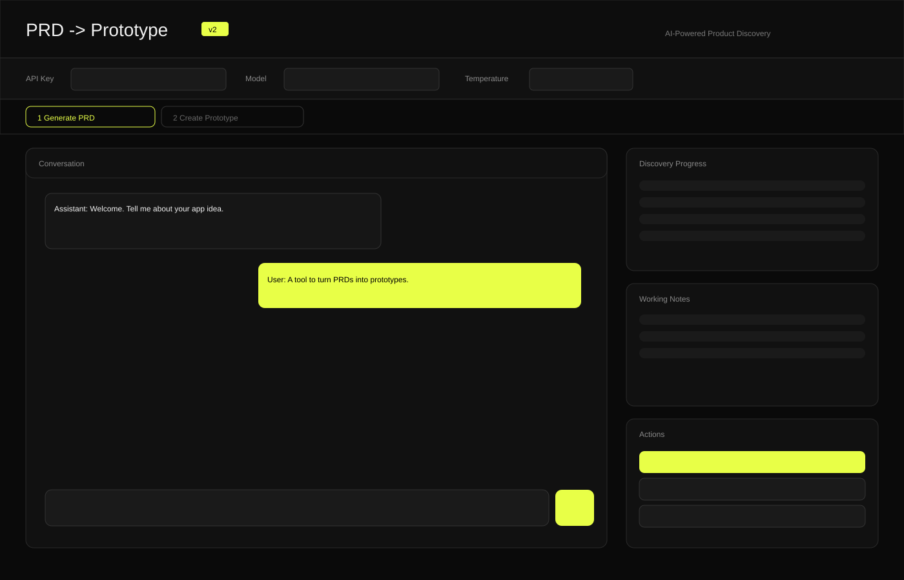
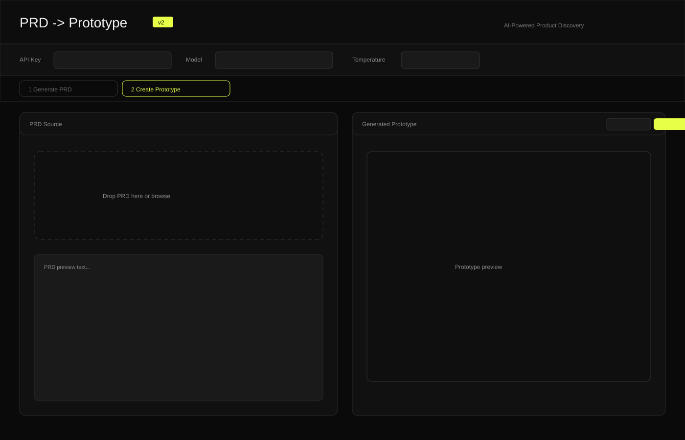

<div align="center">


[](https://developer.mozilla.org/en-US/docs/Web/HTML)
[](https://developer.mozilla.org/en-US/docs/Web/CSS)
[](https://developer.mozilla.org/en-US/docs/Web/JavaScript)
[](https://ai.google.dev/)

</div>

# PRD -> Prototype

Single-page web app that guides product discovery, produces a structured PRD, and turns that PRD into a clickable HTML prototype using Gemini.

## Highlights
- Guided PRD chat with a built-in product discovery flow.
- Working notes and progress tracker to keep the session on track.
- One-click PRD download and optional AI-assisted edits.
- PRD upload or reuse the chat PRD for prototype generation.
- Prototype preview in an iframe with HTML export.
- Model and temperature controls for tuning results.

## UI Screenshots



## How It Works
1. Enter your Gemini API key, choose a model, and start a guided PRD session.
2. Answer a short, structured discovery flow; notes and progress update live.
3. Download the PRD or refine it inside the app.
4. Upload a PRD (or reuse the chat PRD), then generate a prototype.
5. Export the generated HTML for stakeholder review.

## Getting Started
Open [index.html](index.html) in a modern browser.

For reliable API calls (recommended), run a simple local server:
```bash
python -m http.server 8000
```
Then visit http://localhost:8000.

## Configuration
- API key: Required to call Gemini.
- Model: Choose from the dropdown; defaults are provided.
- Temperature: Controls response creativity.

## Project Structure
- [index.html](index.html) - Full app (HTML, CSS, and JavaScript).
- [screenshots/step1-generate-prd.svg](screenshots/step1-generate-prd.svg) - Generate PRD view.
- [screenshots/step2-prototype.svg](screenshots/step2-prototype.svg) - Prototype generation view.

## Known Limitations
- API keys are entered client-side and not stored securely.
- PDF/DOC/DOCX uploads are read as raw text, so formatting is not preserved.
- No persistence; refreshing the page clears chat history and generated output.
- Prototype generation quality depends on the model response and prompt adherence.

## Notes
- The API key is used client-side. Do not share or commit secrets.
- Internet access is required for Google Fonts and Gemini API calls.
